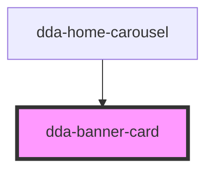

# dda-banner-card

<!-- Auto Generated Below -->

## Properties

| Property                  | Attribute                 | Description                                                                | Type     | Default     |
| ------------------------- | ------------------------- | -------------------------------------------------------------------------- | -------- | ----------- |
| `banner_card_description` | `banner_card_description` | Text under the title. An empty value shows nothing.                        | `string` | `undefined` |
| `banner_card_href`        | `banner_card_href`        | Link URL. With a URL the card is a link; without one it is a button.       | `string` | `undefined` |
| `banner_card_id`          | `banner_card_id`          | `id` of the link or button.                                                | `string` | `undefined` |
| `banner_card_name`        | `banner_card_name`        | `name` of the button (cards without a URL).                                | `string` | `undefined` |
| `banner_card_title`       | `banner_card_title`       | Title of the card; it is the accessible name.                              | `string` | `undefined` |
| `banner_card_url`         | `banner_card_url`         | 3.x name of `banner_card_href`. `banner_card_href` wins when both are set. | `string` | `undefined` |
| `banner_card_value`       | `banner_card_value`       | `value` of the button (cards without a URL).                               | `string` | `undefined` |
| `component_mode`          | `component_mode`          | Theme override class, e.g. `light-mode`.                                   | `string` | `undefined` |
| `custom_class`            | `custom_class`            | Extra CSS classes.                                                         | `string` | `''`        |
| `image_alt`               | `image_alt`               | Kept for 3.x markup. The icon is decorative, so this text is not read.     | `string` | `undefined` |
| `image_src`               | `image_src`               | Icon image URL. The icon is decorative: the title names the card.          | `string` | `undefined` |

## Dependencies

### Used by

 - [dda-home-carousel](../dda-home-carousel)

### Graph

----------------------------------------------

*Built with [StencilJS](https://stenciljs.com/)*
