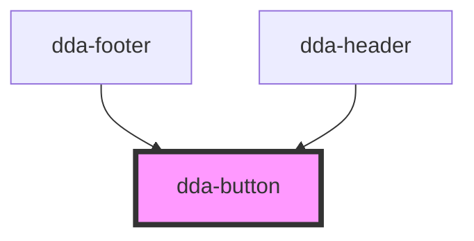

# dda-button

<!-- Auto Generated Below -->

## Properties

| Property            | Attribute           | Description                                                                                    | Type                          | Default     |
| ------------------- | ------------------- | ---------------------------------------------------------------------------------------------- | ----------------------------- | ----------- |
| `aria_label`        | `aria_label`        | Accessible name. Required when the button shows only an icon.                                  | `string`                      | `''`        |
| `button_color`      | `button_color`      | Color variant, e.g. `default-primary`, `default-secondary`, `error-primary`, `onsurface-link`. | `string`                      | `'primary'` |
| `button_id`         | `button_id`         | `id` of the inner `<button>`.                                                                  | `string`                      | `undefined` |
| `button_name`       | `button_name`       | `name` of the inner `<button>`, submitted with its form.                                       | `string`                      | `''`        |
| `button_shape`      | `button_shape`      | Shape: `default` or `circle`.                                                                  | `string`                      | `''`        |
| `clickHandler`      | --                  | Click handler, set as a JavaScript property. You can also listen for the native `click` event. | `(event: MouseEvent) => void` | `undefined` |
| `component_mode`    | `component_mode`    | Theme override class for the button, e.g. `light-mode`.                                        | `string`                      | `undefined` |
| `custom_class`      | `custom_class`      | Extra CSS classes added to the inner `<button>`.                                               | `string`                      | `''`        |
| `disabled`          | `disabled`          | Disables the button.                                                                           | `boolean`                     | `false`     |
| `end_icon`          | `end_icon`          | Material Symbols icon name shown after the label, e.g. `arrow_forward`.                        | `string`                      | `''`        |
| `gap`               | `gap`               | Gap between icon and label, as a spacing step: 1–6, 8, 10, 12 or 16.                           | `number`                      | `undefined` |
| `icon_button_shape` | `icon_button_shape` | Shape of an icon-only button: `default` or `circle`.                                           | `string`                      | `''`        |
| `size`              | `size`              | Size: `sm`, `md`, `lg` or `xl`.                                                                | `string`                      | `undefined` |
| `start_icon`        | `start_icon`        | Material Symbols icon name shown before the label, e.g. `arrow_back`.                          | `string`                      | `''`        |
| `type`              | `type`              | Native button type: `button`, `submit` or `reset`.                                             | `string`                      | `'button'`  |

## Dependencies

### Used by

 - [dda-footer](../dda-footer)
 - [dda-header](../dda-header)

### Graph

----------------------------------------------

*Built with [StencilJS](https://stenciljs.com/)*
