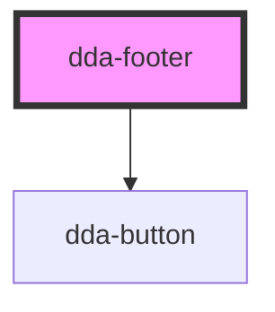

# dda-footer

<!-- Auto Generated Below -->

## Properties

| Property           | Attribute             | Description | Type     | Default     |
| ------------------ | --------------------- | ----------- | -------- | ----------- |
| `copyrightText`    | `copyright-text`      |             | `string` | `undefined` |
| `description`      | `description`         |             | `string` | `undefined` |
| `footerSections`   | `footer-sections`     |             | `string` | `undefined` |
| `footerTitle`      | `footer-title`        |             | `string` | `undefined` |
| `loginButtonText`  | `login-button-text`   |             | `string` | `undefined` |
| `logoAlt`          | `logo-alt`            |             | `string` | `undefined` |
| `logoSrc`          | `logo-src`            |             | `string` | `undefined` |
| `signUpButtonText` | `sign-up-button-text` |             | `string` | `undefined` |
| `socialIcons`      | `social-icons`        |             | `string` | `undefined` |

## Dependencies

### Depends on

- [dda-button](../dda-button)

### Graph

----------------------------------------------

*Built with [StencilJS](https://stenciljs.com/)*
