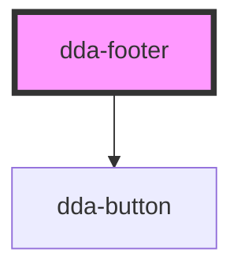

# dda-footer

<!-- Auto Generated Below -->

## Properties

| Property           | Attribute             | Description                                                                                      | Type     | Default     |
| ------------------ | --------------------- | ------------------------------------------------------------------------------------------------ | -------- | ----------- |
| `copyrightText`    | `copyright-text`      | Copyright text in the bottom row.                                                                | `string` | `undefined` |
| `description`      | `description`         | Paragraph under `footerTitle`.                                                                   | `string` | `undefined` |
| `footerSections`   | `footer-sections`     | Link columns. JSON array of `{ title, links: [{ label, href }] }`.                               | `string` | `undefined` |
| `footerTitle`      | `footer-title`        | Heading of the call-to-action area at the top of the footer.                                     | `string` | `undefined` |
| `heading_level`    | `heading_level`       | Heading level (1 to 6) of `footerTitle`, to fit the page's heading order. Default: `4`.          | `number` | `4`         |
| `loginButtonText`  | `login-button-text`   | Label of the tertiary (Login) button. The button has no link or action.                          | `string` | `undefined` |
| `logoAlt`          | `logo-alt`            | Alternative text for the footer logo.                                                            | `string` | `undefined` |
| `logoDescription`  | `logo-description`    | Short text shown under the footer logo. Nothing is shown when it is not set.                     | `string` | `undefined` |
| `logoSrc`          | `logo-src`            | Image URL of the footer logo.                                                                    | `string` | `undefined` |
| `signUpButtonText` | `sign-up-button-text` | Label of the primary (Sign up) button. The button has no link or action.                         | `string` | `undefined` |
| `socialIcons`      | `social-icons`        | Social links in the bottom row. JSON array of `{ href, src, alt }`, where `src` is an image URL. | `string` | `undefined` |

## Dependencies

### Depends on

- [dda-button](../dda-button)

### Graph

```mermaid
graph TD;
  dda-footer --> dda-button
  style dda-footer fill:#f9f,stroke:#333,stroke-width:4px
```

----------------------------------------------

*Built with [StencilJS](https://stenciljs.com/)*
