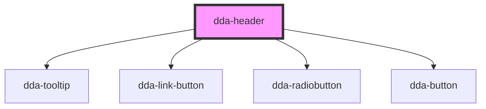

# dda-header

<!-- Auto Generated Below -->

## Properties

| Property                           | Attribute                          | Description | Type     | Default     |
| ---------------------------------- | ---------------------------------- | ----------- | -------- | ----------- |
| `accessibility_button_name`        | `accessibility_button_name`        |             | `string` | `undefined` |
| `close_accessibility_button_name`  | `close_accessibility_button_name`  |             | `string` | `undefined` |
| `close_menu_button_name`           | `close_menu_button_name`           |             | `string` | `undefined` |
| `close_sidebar_button_name`        | `close_sidebar_button_name`        |             | `string` | `undefined` |
| `firstLogoAlt`                     | `first-logo-alt`                   |             | `string` | `undefined` |
| `firstLogoSrc`                     | `first-logo-src`                   |             | `string` | `undefined` |
| `firstLogoWhiteSrc`                | `first-logo-white-src`             |             | `string` | `undefined` |
| `hamburger_menu_button_name`       | `hamburger_menu_button_name`       |             | `string` | `undefined` |
| `language_button_name`             | `language_button_name`             |             | `string` | `undefined` |
| `language_text`                    | `language_text`                    |             | `string` | `undefined` |
| `loginIcon`                        | `login-icon`                       |             | `string` | `undefined` |
| `loginLink`                        | `login-link`                       |             | `string` | `undefined` |
| `loginText`                        | `login-text`                       |             | `string` | `undefined` |
| `quickLinks`                       | `quick-links`                      |             | `string` | `undefined` |
| `readSpeakerLink`                  | `read-speaker-link`                |             | `string` | `undefined` |
| `searchText`                       | `search-text`                      |             | `string` | `undefined` |
| `search_button_name`               | `search_button_name`               |             | `string` | `undefined` |
| `search_input_name`                | `search_input_name`                |             | `string` | `undefined` |
| `secondLogoAlt`                    | `second-logo-alt`                  |             | `string` | `undefined` |
| `secondLogoSrc`                    | `second-logo-src`                  |             | `string` | `undefined` |
| `secondLogoWhiteSrc`               | `second-logo-white-src`            |             | `string` | `undefined` |
| `sideMenuItems`                    | `side-menu-items`                  |             | `string` | `undefined` |
| `toggle_accessibility_button_name` | `toggle_accessibility_button_name` |             | `string` | `undefined` |

## Events

| Event            | Description | Type                |
| ---------------- | ----------- | ------------------- |
| `baseTextSize`   |             | `CustomEvent<void>` |
| `blindContrast`  |             | `CustomEvent<void>` |
| `greenContrast`  |             | `CustomEvent<void>` |
| `languageSwitch` |             | `CustomEvent<void>` |
| `lgTextSize`     |             | `CustomEvent<void>` |
| `normalContrast` |             | `CustomEvent<void>` |
| `redContrast`    |             | `CustomEvent<void>` |
| `smTextSize`     |             | `CustomEvent<void>` |

## Dependencies

### Depends on

- [dda-tooltip](../dda-tooltip)
- [dda-link-button](../dda-link-button)
- [dda-radiobutton](../dda-radiobutton)
- [dda-button](../dda-button)

### Graph

----------------------------------------------

*Built with [StencilJS](https://stenciljs.com/)*
