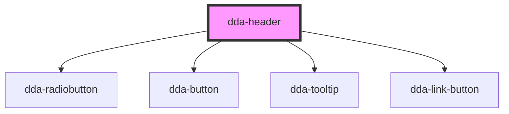

# dda-header

<!-- Auto Generated Below -->

## Properties

| Property                           | Attribute                          | Description                                                                                                                                                | Type                                                           | Default     |
| ---------------------------------- | ---------------------------------- | ---------------------------------------------------------------------------------------------------------------------------------------------------------- | -------------------------------------------------------------- | ----------- |
| `accessibility_button_name`        | `accessibility_button_name`        | `name` attribute of the accessibility button in the side menu.                                                                                             | `string`                                                       | `undefined` |
| `close_accessibility_button_name`  | `close_accessibility_button_name`  | `name` attribute of the buttons that close the accessibility panel.                                                                                        | `string`                                                       | `undefined` |
| `close_menu_button_name`           | `close_menu_button_name`           | `name` attribute of the button that closes the side menu.                                                                                                  | `string`                                                       | `undefined` |
| `close_sidebar_button_name`        | `close_sidebar_button_name`        | Not used: the current markup does not render an element with this name.                                                                                    | `string`                                                       | `undefined` |
| `contrast_color_blind_text`        | `contrast_color_blind_text`        | Label of the colour-blind contrast option. Default: `Colours Blind`.                                                                                       | `string`                                                       | `undefined` |
| `contrast_description`             | `contrast_description`             | Text above the contrast options. Default: `Select your preferred contrast setting`.                                                                        | `string`                                                       | `undefined` |
| `contrast_green_weakness_text`     | `contrast_green_weakness_text`     | Label of the green-weakness contrast option. Default: `Green Weakness`.                                                                                    | `string`                                                       | `undefined` |
| `contrast_noraml_text`             | `contrast_noraml_text`             | 3.x spelling of `contrast_normal_text`. `contrast_normal_text` wins when both are set.                                                                     | `string`                                                       | `undefined` |
| `contrast_normal_text`             | `contrast_normal_text`             | Label of the normal contrast option. Default: `Normal`.                                                                                                    | `string`                                                       | `undefined` |
| `contrast_red_weakness_text`       | `contrast_red_weakness_text`       | Label of the red-weakness contrast option. Default: `Red Weakness`.                                                                                        | `string`                                                       | `undefined` |
| `contrast_title`                   | `contrast_title`                   | Heading of the contrast column in the accessibility panel. Default: `Contrast`. An empty value removes the heading.                                        | `string`                                                       | `undefined` |
| `firstLogoAlt`                     | `first-logo-alt`                   | Alternative text for the first logo.                                                                                                                       | `string`                                                       | `undefined` |
| `firstLogoHref`                    | `first-logo-href`                  | Link URL of the first logo in the header and the side menu. Default: `/`.                                                                                  | `string`                                                       | `'/'`       |
| `firstLogoSrc`                     | `first-logo-src`                   | Image URL of the first (government) logo, on the left of the header and in the side menu.                                                                  | `string`                                                       | `undefined` |
| `firstLogoWhiteSrc`                | `first-logo-white-src`             | Image URL of the white first logo, shown in dark theme and on a transparent header (`<body class="transparent">`). Falls back to `firstLogoSrc`.           | `string`                                                       | `undefined` |
| `hamburger_menu_button_name`       | `hamburger_menu_button_name`       | `name` attribute of the hamburger menu button.                                                                                                             | `string`                                                       | `undefined` |
| `hide_login`                       | `hide_login`                       | Hides the Login link in the desktop toolbar and the side menu.                                                                                             | `boolean`                                                      | `false`     |
| `language_button_name`             | `language_button_name`             | `name` attribute of the language button in the side menu.                                                                                                  | `string`                                                       | `undefined` |
| `language_lang`                    | `language_lang`                    | `lang` attribute of the language buttons, the language of `language_text`. Default: `ar`.                                                                  | `string`                                                       | `'ar'`      |
| `language_text`                    | `language_text`                    | Label of the language buttons in the desktop toolbar and the side menu. Default: `العربية`.                                                                | `string`                                                       | `undefined` |
| `loginIcon`                        | `login-icon`                       | Material Symbols icon name of the Login link in the desktop toolbar and the side menu. Default: `sentiment_satisfied`.                                     | `string`                                                       | `undefined` |
| `loginLink`                        | `login-link`                       | URL of the Login link in the toolbar and the side menu.                                                                                                    | `string`                                                       | `undefined` |
| `loginText`                        | `login-text`                       | Label of the Login link in the desktop toolbar and the side menu. Default: `Login`.                                                                        | `string`                                                       | `undefined` |
| `menu_button_label`                | `menu_button_label`                | Accessible name of the hamburger menu button (visually hidden text). Default: `Menu`.                                                                      | `string`                                                       | `'Menu'`    |
| `quickLinks`                       | `quick-links`                      | Main navigation links. JSON array of `{ label, href, menuLabel, subMenu }`; `subMenu` items are `{ title, description, icon, href }` and open a mega menu. | `string`                                                       | `undefined` |
| `readSpeakerLink`                  | `read-speaker-link`                | URL of the ReadSpeaker "listen" link in the accessibility panel.                                                                                           | `string`                                                       | `undefined` |
| `read_speaker_link`                | `read_speaker_link`                | 3.x name of `readSpeakerLink`, as an attribute: `read_speaker_link`. `readSpeakerLink` wins when both are set.                                             | `string`                                                       | `undefined` |
| `screen_reader_description`        | `screen_reader_description`        | Text in the screen reader column. Default: `Listen to the content of the page by clicking play or listen`.                                                 | `string`                                                       | `undefined` |
| `screen_reader_link_label`         | `screen_reader_link_label`         | Accessible name of the ReadSpeaker play link. Default: `Listen to this page using ReadSpeaker`.                                                            | `string`                                                       | `undefined` |
| `screen_reader_title`              | `screen_reader_title`              | Heading of the screen reader column. Default: `Screen Reader`.                                                                                             | `string`                                                       | `undefined` |
| `searchText`                       | `search-text`                      | Placeholder and accessible label of the search input. Default: `Search`.                                                                                   | `string`                                                       | `undefined` |
| `search_action`                    | `search_action`                    | Results page URL. When set, a search does a GET to this URL with the query in `search_input_name` (default `q`).                                           | `string`                                                       | `undefined` |
| `search_button_name`               | `search_button_name`               | `name` attribute of the mobile search button.                                                                                                              | `string`                                                       | `undefined` |
| `search_input_name`                | `search_input_name`                | `name` of the search input, which is the query parameter sent to `search_action`. Default: `q`.                                                            | `string`                                                       | `undefined` |
| `secondLogoAlt`                    | `second-logo-alt`                  | Alternative text for the second logo.                                                                                                                      | `string`                                                       | `undefined` |
| `secondLogoHref`                   | `second-logo-href`                 | Link URL of the second logo on desktop and mobile. Default: `/`.                                                                                           | `string`                                                       | `'/'`       |
| `secondLogoSrc`                    | `second-logo-src`                  | Image URL of the second (entity) logo.                                                                                                                     | `string`                                                       | `undefined` |
| `secondLogoWhiteSrc`               | `second-logo-white-src`            | Image URL of the white second logo, shown in dark theme and on a transparent header. Falls back to `secondLogoSrc` on desktop.                             | `string`                                                       | `undefined` |
| `selected_contrast`                | `selected_contrast`                | The contrast option shown as selected. The header updates it when the user picks an option. Default: `normal`.                                             | `"colorblind" \| "greenweakness" \| "normal" \| "redweakness"` | `'normal'`  |
| `selected_text_size`               | `selected_text_size`               | The text size button shown as selected (`default-primary`). The header updates it on each click. Default: none.                                            | `"large" \| "normal" \| "small"`                               | `undefined` |
| `sideMenuItems`                    | `side-menu-items`                  | Side menu items. JSON array of `{ label, href, subMenu }`; each `subMenu` item is `{ headerLabel, label, href, subMenu }` and can nest.                    | `string`                                                       | `undefined` |
| `text_size_description`            | `text_size_description`            | Text in the text size column. Default: `Use the buttons below to increase or decrease the text size`.                                                      | `string`                                                       | `undefined` |
| `text_size_title`                  | `text_size_title`                  | Heading of the text size column. Default: `Text Size`.                                                                                                     | `string`                                                       | `undefined` |
| `toggle_accessibility_button_name` | `toggle_accessibility_button_name` | `name` attribute of the accessibility button in the desktop toolbar.                                                                                       | `string`                                                       | `undefined` |

## Events

| Event            | Description                                                                                                                                                             | Type                              |
| ---------------- | ----------------------------------------------------------------------------------------------------------------------------------------------------------------------- | --------------------------------- |
| `baseTextSize`   | Emitted when the user clicks the `A` (default text size) button in the accessibility panel.                                                                             | `CustomEvent<void>`               |
| `blindContrast`  | Emitted when the user selects the Colours Blind contrast option.                                                                                                        | `CustomEvent<void>`               |
| `greenContrast`  | Emitted when the user selects the Green Weakness contrast option.                                                                                                       | `CustomEvent<void>`               |
| `languageSwitch` | Emitted when the user clicks the language button.                                                                                                                       | `CustomEvent<void>`               |
| `lgTextSize`     | Emitted when the user clicks the `A+` (larger text) button in the accessibility panel.                                                                                  | `CustomEvent<void>`               |
| `normalContrast` | Emitted when the user selects the Normal contrast option.                                                                                                               | `CustomEvent<void>`               |
| `redContrast`    | Emitted when the user selects the Red Weakness contrast option.                                                                                                         | `CustomEvent<void>`               |
| `searchSubmit`   | Emitted when a non-empty search is submitted. Call `preventDefault()` to stop the browser navigating to `search_action`, for example to route inside a single-page app. | `CustomEvent<{ query: string; }>` |
| `smTextSize`     | Emitted when the user clicks the `A-` (smaller text) button in the accessibility panel.                                                                                 | `CustomEvent<void>`               |

## Dependencies

### Depends on

- [dda-radiobutton](../dda-radiobutton)
- [dda-button](../dda-button)
- [dda-tooltip](../dda-tooltip)
- [dda-link-button](../dda-link-button)

### Graph

```mermaid
graph TD;
  dda-header --> dda-radiobutton
  dda-header --> dda-button
  dda-header --> dda-tooltip
  dda-header --> dda-link-button
  style dda-header fill:#f9f,stroke:#333,stroke-width:4px
```

----------------------------------------------

*Built with [StencilJS](https://stenciljs.com/)*
