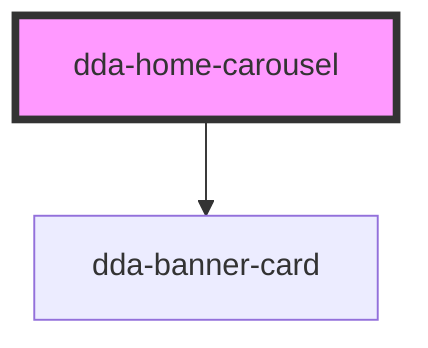

# dda-home-carousel

<!-- Auto Generated Below -->

## Properties

| Property         | Attribute        | Description                                                                                                                                                                                                               | Type                         | Default         |
| ---------------- | ---------------- | ------------------------------------------------------------------------------------------------------------------------------------------------------------------------------------------------------------------------- | ---------------------------- | --------------- |
| `aria_label`     | `aria_label`     | Accessible name of the card list. Default: `Quick links`.                                                                                                                                                                 | `string`                     | `'Quick links'` |
| `bannercardlist` | `bannercardlist` | The cards. JSON array, or array property, of `{ banner_card_href, banner_card_title, banner_card_description, image_src, image_alt, banner_card_id, banner_card_value, banner_card_name, custom_class, component_mode }`. | `BannerCardItem[] \| string` | `undefined`     |
| `component_mode` | `component_mode` | Theme override class, e.g. `light-mode`.                                                                                                                                                                                  | `string`                     | `undefined`     |
| `custom_class`   | `custom_class`   | Extra CSS classes on the list.                                                                                                                                                                                            | `string`                     | `''`            |
| `items_in_view`  | `items_in_view`  | Cards shown at once on wide screens. A card is never narrower than 220px. Default: `5`.                                                                                                                                   | `number`                     | `5`             |

## Events

| Event       | Description                                                                 | Type                          |
| ----------- | --------------------------------------------------------------------------- | ----------------------------- |
| `cardClick` | Emitted when a card is clicked, with its item. A link card still navigates. | `CustomEvent<BannerCardItem>` |

## Dependencies

### Depends on

- [dda-banner-card](../dda-banner-card)

### Graph

----------------------------------------------

*Built with [StencilJS](https://stenciljs.com/)*
