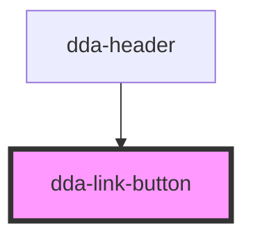

# dda-link-button

<!-- Auto Generated Below -->

## Properties

| Property            | Attribute           | Description                              | Type      | Default     |
| ------------------- | ------------------- | ---------------------------------------- | --------- | ----------- |
| `aria_label`        | `aria_label`        |                                          | `string`  | `''`        |
| `button_color`      | `button_color`      |                                          | `string`  | `'primary'` |
| `button_id`         | `button_id`         |                                          | `string`  | `undefined` |
| `button_shape`      | `button_shape`      |                                          | `string`  | `''`        |
| `component_mode`    | `component_mode`    |                                          | `string`  | `undefined` |
| `custom_class`      | `custom_class`      |                                          | `string`  | `''`        |
| `disabled`          | `disabled`          | Disable the button                       | `boolean` | `false`     |
| `end_icon`          | `end_icon`          |                                          | `string`  | `''`        |
| `gap`               | `gap`               |                                          | `number`  | `undefined` |
| `href`              | `href`              |                                          | `string`  | `'#'`       |
| `icon_button_shape` | `icon_button_shape` |                                          | `string`  | `''`        |
| `size`              | `size`              |                                          | `string`  | `undefined` |
| `start_icon`        | `start_icon`        | Icon class for the starting icon         | `string`  | `''`        |
| `type`              | `type`              | Type of button, e.g., "button", "submit" | `string`  | `'button'`  |

## Dependencies

### Used by

 - [dda-header](../dda-header)

### Graph

----------------------------------------------

*Built with [StencilJS](https://stenciljs.com/)*
