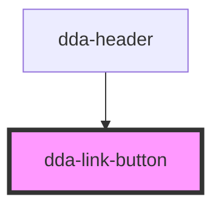

# dda-link-button

<!-- Auto Generated Below -->

## Properties

| Property            | Attribute           | Description                                                                                                  | Type      | Default     |
| ------------------- | ------------------- | ------------------------------------------------------------------------------------------------------------ | --------- | ----------- |
| `aria_label`        | `aria_label`        | Accessible name of the link. Required when the link shows only an icon.                                      | `string`  | `''`        |
| `button_color`      | `button_color`      | Color variant, e.g. `default-primary`, `default-secondary`, `error-primary`, `onsurface-link` or `disabled`. | `string`  | `'primary'` |
| `button_id`         | `button_id`         | `id` of the inner `<a>`.                                                                                     | `string`  | `undefined` |
| `button_shape`      | `button_shape`      | Shape: `default` or `circle`.                                                                                | `string`  | `''`        |
| `component_mode`    | `component_mode`    | Theme override class for the link, e.g. `light-mode`.                                                        | `string`  | `undefined` |
| `custom_class`      | `custom_class`      | Extra CSS classes added to the inner `<a>`.                                                                  | `string`  | `''`        |
| `disabled`          | `disabled`          | Not used: the link stays active. For a disabled look, set `button_color` to `disabled`.                      | `boolean` | `false`     |
| `end_icon`          | `end_icon`          | Material Symbols icon name shown after the label, e.g. `arrow_forward`.                                      | `string`  | `''`        |
| `gap`               | `gap`               | Gap between icon and label, as a spacing step: 1–6, 8, 10, 12 or 16.                                         | `number`  | `undefined` |
| `href`              | `href`              | URL the link opens.                                                                                          | `string`  | `'#'`       |
| `icon_button_shape` | `icon_button_shape` | Shape of an icon-only link: `default` or `circle`.                                                           | `string`  | `''`        |
| `size`              | `size`              | Size: `sm`, `md`, `lg` or `xl`.                                                                              | `string`  | `undefined` |
| `start_icon`        | `start_icon`        | Material Symbols icon name shown before the label, e.g. `arrow_back`.                                        | `string`  | `''`        |
| `type`              | `type`              | Not used: the component renders an `<a>` link, which has no `type`.                                          | `string`  | `'button'`  |

## Dependencies

### Used by

 - [dda-header](../dda-header)

### Graph

```mermaid
graph TD;
  dda-header --> dda-link-button
  style dda-link-button fill:#f9f,stroke:#333,stroke-width:4px
```

----------------------------------------------

*Built with [StencilJS](https://stenciljs.com/)*
