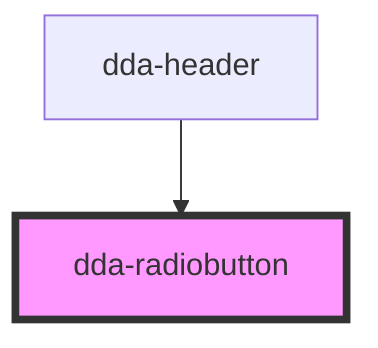

# dda-radiobutton

<!-- Auto Generated Below -->

## Properties

| Property         | Attribute        | Description | Type      | Default     |
| ---------------- | ---------------- | ----------- | --------- | ----------- |
| `aria_label`     | `aria_label`     |             | `string`  | `undefined` |
| `checked`        | `checked`        |             | `boolean` | `undefined` |
| `component_mode` | `component_mode` |             | `string`  | `undefined` |
| `custom_class`   | `custom_class`   |             | `string`  | `''`        |
| `group_name`     | `group_name`     |             | `string`  | `undefined` |
| `input_id`       | `input_id`       |             | `string`  | `undefined` |
| `radio_status`   | `radio_status`   |             | `string`  | `undefined` |
| `size`           | `size`           |             | `string`  | `undefined` |
| `supporting`     | `supporting`     |             | `string`  | `undefined` |
| `title_text`     | `title_text`     |             | `string`  | `undefined` |
| `variants`       | `variants`       |             | `string`  | `undefined` |

## Dependencies

### Used by

 - [dda-header](../dda-header)

### Graph

----------------------------------------------

*Built with [StencilJS](https://stenciljs.com/)*
