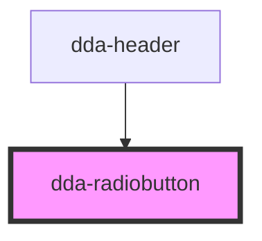

# dda-radiobutton

<!-- Auto Generated Below -->

## Properties

| Property         | Attribute        | Description                                                                                               | Type      | Default     |
| ---------------- | ---------------- | --------------------------------------------------------------------------------------------------------- | --------- | ----------- |
| `aria_label`     | `aria_label`     | Accessible name of the inner radio input.                                                                 | `string`  | `undefined` |
| `checked`        | `checked`        | Checked state of the inner input. Read the current state from the input or its `change` event.            | `boolean` | `undefined` |
| `component_mode` | `component_mode` | Theme override class for the radio button, e.g. `light-mode`.                                             | `string`  | `undefined` |
| `custom_class`   | `custom_class`   | Extra class suffix. The value is added as `dda-radio-<value>` on the container.                           | `string`  | `''`        |
| `group_name`     | `group_name`     | `name` of the inner radio input. Give all radio buttons in one group the same value.                      | `string`  | `undefined` |
| `input_id`       | `input_id`       | `id` of the inner radio input. The label points to it, so set a unique value to make the label clickable. | `string`  | `undefined` |
| `radio_status`   | `radio_status`   | Status: `disabled` shows the disabled style and blocks pointer clicks.                                    | `string`  | `undefined` |
| `size`           | `size`           | Size: `sm`, `md` or `lg`.                                                                                 | `string`  | `undefined` |
| `supporting`     | `supporting`     | Secondary text shown under the title.                                                                     | `string`  | `undefined` |
| `title_text`     | `title_text`     | Label shown next to the radio button.                                                                     | `string`  | `undefined` |
| `variants`       | `variants`       | Style variant: `outlined` or `faded`. Leave empty (or `normal`) for the default style.                    | `string`  | `undefined` |

## Dependencies

### Used by

 - [dda-header](../dda-header)

### Graph

```mermaid
graph TD;
  dda-header --> dda-radiobutton
  style dda-radiobutton fill:#f9f,stroke:#333,stroke-width:4px
```

----------------------------------------------

*Built with [StencilJS](https://stenciljs.com/)*
