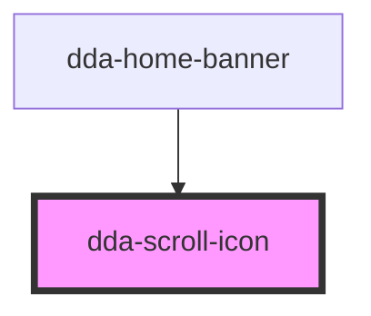

# dda-scroll-icon

<!-- Auto Generated Below -->

## Properties

| Property            | Attribute           | Description                                                  | Type                 | Default     |
| ------------------- | ------------------- | ------------------------------------------------------------ | -------------------- | ----------- |
| `component_mode`    | `component_mode`    | Theme override class, e.g. `light-mode`.                     | `string`             | `undefined` |
| `custom_class`      | `custom_class`      | Extra CSS classes on the icon.                               | `string`             | `''`        |
| `scroll_icon_color` | `scroll_icon_color` | Colour: `white` or `black`. Default: `white`.                | `"black" \| "white"` | `'white'`   |
| `scroll_icon_size`  | `scroll_icon_size`  | Size: `sm` (16.5 × 24px) or `lg` (40 × 60px). Default: `sm`. | `"lg" \| "sm"`       | `'sm'`      |

## Dependencies

### Used by

 - [dda-home-banner](../dda-home-banner)

### Graph

----------------------------------------------

*Built with [StencilJS](https://stenciljs.com/)*
