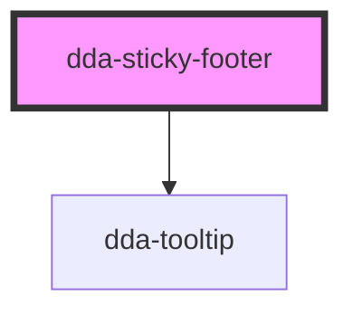

# dda-sticky-footer

<!-- Auto Generated Below -->

## Properties

| Property                   | Attribute                    | Description          | Type      | Default     |
| -------------------------- | ---------------------------- | -------------------- | --------- | ----------- |
| `accessibilityIconAlt`     | `accessibility-icon-alt`     |                      | `string`  | `undefined` |
| `accessibilityIconHref`    | `accessibility-icon-href`    |                      | `string`  | `undefined` |
| `accessibilityIconSrc`     | `accessibility-icon-src`     |                      | `string`  | `undefined` |
| `accessibilityIconTooltip` | `accessibility-icon-tooltip` |                      | `string`  | `undefined` |
| `aiIconAlt`                | `ai-icon-alt`                |                      | `string`  | `undefined` |
| `aiIconHref`               | `ai-icon-href`               |                      | `string`  | `undefined` |
| `aiIconSrc`                | `ai-icon-src`                |                      | `string`  | `undefined` |
| `aiIconTooltip`            | `ai-icon-tooltip`            |                      | `string`  | `undefined` |
| `chatIconAlt`              | `chat-icon-alt`              |                      | `string`  | `undefined` |
| `chatIconHref`             | `chat-icon-href`             |                      | `string`  | `undefined` |
| `chatIconSrc`              | `chat-icon-src`              |                      | `string`  | `undefined` |
| `chatIconTooltip`          | `chat-icon-tooltip`          |                      | `string`  | `undefined` |
| `firstLogoAlt`             | `first-logo-alt`             |                      | `string`  | `undefined` |
| `firstLogoHref`            | `first-logo-href`            | Middle Section Props | `string`  | `undefined` |
| `firstLogoSrc`             | `first-logo-src`             |                      | `string`  | `undefined` |
| `firstLogoTooltip`         | `first-logo-tooltip`         |                      | `string`  | `undefined` |
| `happinessIconAlt`         | `happiness-icon-alt`         |                      | `string`  | `undefined` |
| `happinessIconHref`        | `happiness-icon-href`        | Left Section Props   | `string`  | `undefined` |
| `happinessIconSrc`         | `happiness-icon-src`         |                      | `string`  | `undefined` |
| `happinessIconTooltip`     | `happiness-icon-tooltip`     |                      | `string`  | `undefined` |
| `hideMiddleSection`        | `hide-middle-section`        |                      | `boolean` | `undefined` |
| `locationButtonHref`       | `location-button-href`       | Right Section Props  | `string`  | `undefined` |
| `locationButtonIcon`       | `location-button-icon`       |                      | `string`  | `undefined` |
| `locationButtonText`       | `location-button-text`       |                      | `string`  | `undefined` |
| `locationLogoSrc`          | `location-logo-src`          |                      | `string`  | `undefined` |
| `newsButtonHref`           | `news-button-href`           |                      | `string`  | `undefined` |
| `newsButtonIcon`           | `news-button-icon`           |                      | `string`  | `undefined` |
| `newsButtonSrc`            | `news-button-src`            |                      | `string`  | `undefined` |
| `newsButtonText`           | `news-button-text`           |                      | `string`  | `undefined` |
| `secondLogoAlt`            | `second-logo-alt`            |                      | `string`  | `undefined` |
| `secondLogoHref`           | `second-logo-href`           |                      | `string`  | `undefined` |
| `secondLogoSrc`            | `second-logo-src`            |                      | `string`  | `undefined` |
| `secondLogoTooltip`        | `second-logo-tooltip`        |                      | `string`  | `undefined` |
| `servicesIconAlt`          | `services-icon-alt`          |                      | `string`  | `undefined` |
| `servicesIconHref`         | `services-icon-href`         |                      | `string`  | `undefined` |
| `servicesIconSrc`          | `services-icon-src`          |                      | `string`  | `undefined` |
| `servicesIconText`         | `services-icon-text`         |                      | `string`  | `undefined` |
| `servicesIconTooltip`      | `services-icon-tooltip`      |                      | `string`  | `undefined` |
| `thirdLogoAlt`             | `third-logo-alt`             |                      | `string`  | `undefined` |
| `thirdLogoHref`            | `third-logo-href`            |                      | `string`  | `undefined` |
| `thirdLogoSrc`             | `third-logo-src`             |                      | `string`  | `undefined` |
| `thirdLogoTooltip`         | `third-logo-tooltip`         |                      | `string`  | `undefined` |

## Dependencies

### Depends on

- [dda-tooltip](../dda-tooltip)

### Graph

----------------------------------------------

*Built with [StencilJS](https://stenciljs.com/)*
