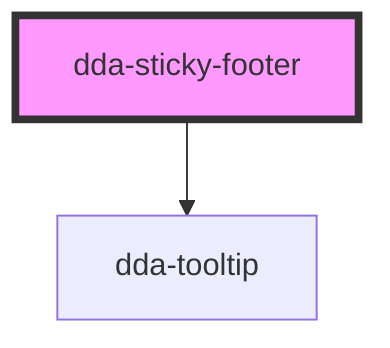

# dda-sticky-footer

<!-- Auto Generated Below -->

## Properties

| Property                   | Attribute                    | Description                                                                            | Type      | Default           |
| -------------------------- | ---------------------------- | -------------------------------------------------------------------------------------- | --------- | ----------------- |
| `accessibilityIconAlt`     | `accessibility-icon-alt`     | Alternative text for the accessibility icon.                                           | `string`  | `undefined`       |
| `accessibilityIconHref`    | `accessibility-icon-href`    | Link URL of the accessibility icon, the second icon in the left section.               | `string`  | `undefined`       |
| `accessibilityIconSrc`     | `accessibility-icon-src`     | Image URL of the accessibility icon.                                                   | `string`  | `undefined`       |
| `accessibilityIconTooltip` | `accessibility-icon-tooltip` | Tooltip text of the accessibility icon.                                                | `string`  | `undefined`       |
| `aiIconAlt`                | `ai-icon-alt`                | Alternative text for the AI assistant icon.                                            | `string`  | `undefined`       |
| `aiIconHref`               | `ai-icon-href`               | Link URL of the AI assistant icon (right section).                                     | `string`  | `undefined`       |
| `aiIconSrc`                | `ai-icon-src`                | Image URL of the AI assistant icon.                                                    | `string`  | `undefined`       |
| `aiIconTooltip`            | `ai-icon-tooltip`            | Tooltip text of the AI assistant icon.                                                 | `string`  | `undefined`       |
| `aria_label`               | `aria_label`                 | Accessible name of the bar's `<aside>` landmark. Default: `Quick actions`.             | `string`  | `'Quick actions'` |
| `chatIconAlt`              | `chat-icon-alt`              | Alternative text for the chat icon.                                                    | `string`  | `undefined`       |
| `chatIconHref`             | `chat-icon-href`             | Link URL of the chat icon (right section).                                             | `string`  | `undefined`       |
| `chatIconSrc`              | `chat-icon-src`              | Image URL of the chat icon.                                                            | `string`  | `undefined`       |
| `chatIconTooltip`          | `chat-icon-tooltip`          | Tooltip text of the chat icon.                                                         | `string`  | `undefined`       |
| `firstLogoAlt`             | `first-logo-alt`             | Alternative text for the first logo.                                                   | `string`  | `undefined`       |
| `firstLogoHref`            | `first-logo-href`            | Link URL of the first logo (middle section).                                           | `string`  | `undefined`       |
| `firstLogoSrc`             | `first-logo-src`             | Image URL of the first logo.                                                           | `string`  | `undefined`       |
| `firstLogoTooltip`         | `first-logo-tooltip`         | Tooltip text of the first logo.                                                        | `string`  | `undefined`       |
| `happinessIconAlt`         | `happiness-icon-alt`         | Alternative text for the happiness icon.                                               | `string`  | `undefined`       |
| `happinessIconHref`        | `happiness-icon-href`        | Link URL of the happiness icon (left section).                                         | `string`  | `undefined`       |
| `happinessIconSrc`         | `happiness-icon-src`         | Image URL of the happiness icon.                                                       | `string`  | `undefined`       |
| `happinessIconTooltip`     | `happiness-icon-tooltip`     | Tooltip text of the happiness icon.                                                    | `string`  | `undefined`       |
| `hideMiddleSection`        | `hide-middle-section`        | Hides the middle logo section. The section shows only when this is explicitly `false`. | `boolean` | `undefined`       |
| `locationButtonHref`       | `location-button-href`       | Link URL of the location icon (right section).                                         | `string`  | `undefined`       |
| `locationButtonIcon`       | `location-button-icon`       | Not used: the current markup does not render it.                                       | `string`  | `undefined`       |
| `locationButtonText`       | `location-button-text`       | Tooltip text and alternative text of the location icon.                                | `string`  | `undefined`       |
| `locationLogoSrc`          | `location-logo-src`          | Image URL of the location icon.                                                        | `string`  | `undefined`       |
| `newsButtonHref`           | `news-button-href`           | Link URL of the news icon (right section).                                             | `string`  | `undefined`       |
| `newsButtonIcon`           | `news-button-icon`           | Not used: the current markup does not render it.                                       | `string`  | `undefined`       |
| `newsButtonSrc`            | `news-button-src`            | Image URL of the news icon.                                                            | `string`  | `undefined`       |
| `newsButtonText`           | `news-button-text`           | Tooltip text and alternative text of the news icon.                                    | `string`  | `undefined`       |
| `secondLogoAlt`            | `second-logo-alt`            | Alternative text for the second logo.                                                  | `string`  | `undefined`       |
| `secondLogoHref`           | `second-logo-href`           | Link URL of the second logo (middle section).                                          | `string`  | `undefined`       |
| `secondLogoSrc`            | `second-logo-src`            | Image URL of the second logo.                                                          | `string`  | `undefined`       |
| `secondLogoTooltip`        | `second-logo-tooltip`        | Tooltip text of the second logo.                                                       | `string`  | `undefined`       |
| `servicesIconAlt`          | `services-icon-alt`          | Alternative text for the services icon.                                                | `string`  | `undefined`       |
| `servicesIconHref`         | `services-icon-href`         | Link URL of the services icon (left section).                                          | `string`  | `undefined`       |
| `servicesIconSrc`          | `services-icon-src`          | Image URL of the services icon.                                                        | `string`  | `undefined`       |
| `servicesIconText`         | `services-icon-text`         | Text shown next to the services icon. Nothing is shown when it is not set.             | `string`  | `undefined`       |
| `servicesIconTooltip`      | `services-icon-tooltip`      | Tooltip text of the services icon.                                                     | `string`  | `undefined`       |
| `thirdLogoAlt`             | `third-logo-alt`             | Alternative text for the third logo.                                                   | `string`  | `undefined`       |
| `thirdLogoHref`            | `third-logo-href`            | Link URL of the third logo (middle section).                                           | `string`  | `undefined`       |
| `thirdLogoSrc`             | `third-logo-src`             | Image URL of the third logo.                                                           | `string`  | `undefined`       |
| `thirdLogoTooltip`         | `third-logo-tooltip`         | Tooltip text of the third logo.                                                        | `string`  | `undefined`       |

## Dependencies

### Depends on

- [dda-tooltip](../dda-tooltip)

### Graph

```mermaid
graph TD;
  dda-sticky-footer --> dda-tooltip
  style dda-sticky-footer fill:#f9f,stroke:#333,stroke-width:4px
```

----------------------------------------------

*Built with [StencilJS](https://stenciljs.com/)*
