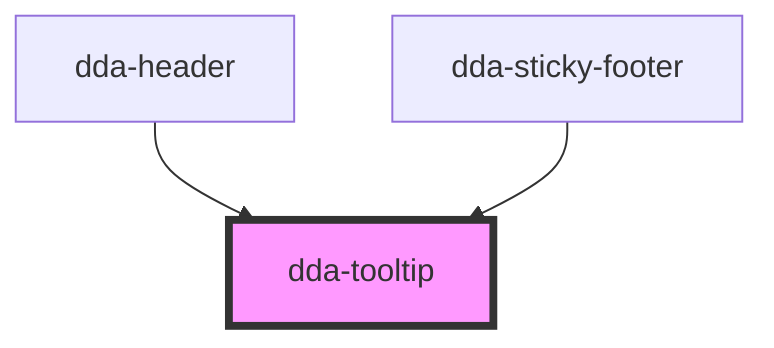

# dda-tooltip

<!-- Auto Generated Below -->

## Properties

| Property         | Attribute        | Description | Type                                     | Default     |
| ---------------- | ---------------- | ----------- | ---------------------------------------- | ----------- |
| `component_mode` | `component_mode` |             | `string`                                 | `undefined` |
| `custom_class`   | `custom_class`   |             | `string`                                 | `''`        |
| `description`    | `description`    |             | `string`                                 | `undefined` |
| `position`       | `position`       |             | `"bottom" \| "left" \| "right" \| "top"` | `'top'`     |
| `title_text`     | `title_text`     |             | `string`                                 | `undefined` |

## Dependencies

### Used by

 - [dda-header](../dda-header)
 - [dda-sticky-footer](../dda-sticky-footer)

### Graph

----------------------------------------------

*Built with [StencilJS](https://stenciljs.com/)*
