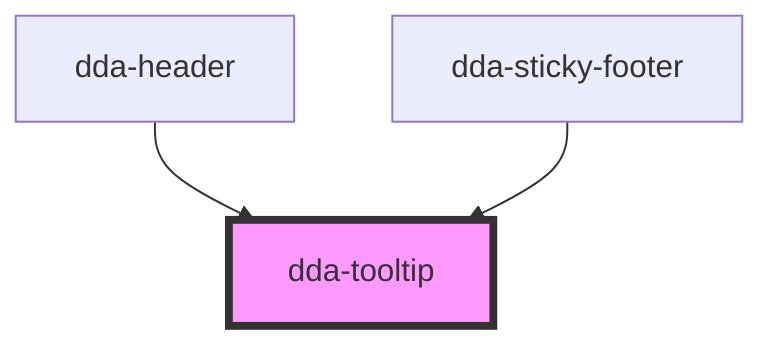

# dda-tooltip

<!-- Auto Generated Below -->

## Properties

| Property         | Attribute        | Description                                                                                              | Type                                     | Default     |
| ---------------- | ---------------- | -------------------------------------------------------------------------------------------------------- | ---------------------------------------- | ----------- |
| `component_mode` | `component_mode` | Theme class added to the tooltip container, e.g. `light-mode`. The tooltip styles do not change with it. | `string`                                 | `undefined` |
| `custom_class`   | `custom_class`   | Extra CSS classes added to the tooltip container.                                                        | `string`                                 | `''`        |
| `description`    | `description`    | Text shown below the heading in the tooltip box.                                                         | `string`                                 | `undefined` |
| `position`       | `position`       | Side of the trigger where the box appears: `top`, `bottom`, `left` or `right`.                           | `"bottom" \| "left" \| "right" \| "top"` | `'top'`     |
| `title_text`     | `title_text`     | Bold heading shown in the tooltip box.                                                                   | `string`                                 | `undefined` |

## Dependencies

### Used by

 - [dda-header](../dda-header)
 - [dda-sticky-footer](../dda-sticky-footer)

### Graph

```mermaid
graph TD;
  dda-header --> dda-tooltip
  dda-sticky-footer --> dda-tooltip
  style dda-tooltip fill:#f9f,stroke:#333,stroke-width:4px
```

----------------------------------------------

*Built with [StencilJS](https://stenciljs.com/)*
